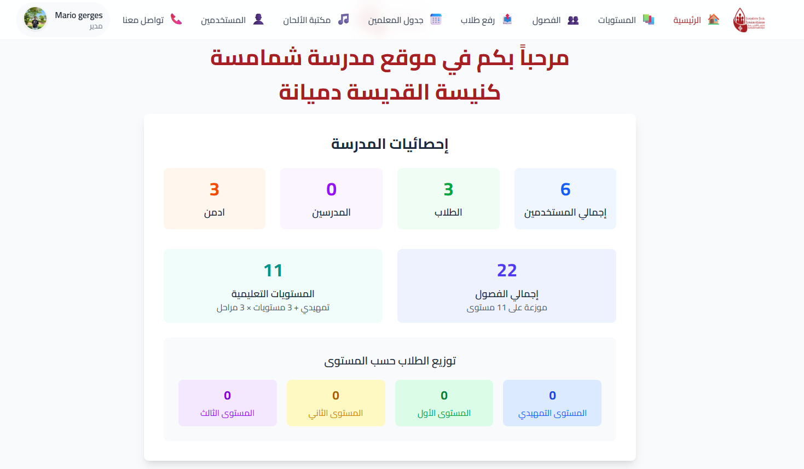

# Deacons School

Modern full‑stack platform for church/deacons school management — classes, levels, curriculum, hymns (with audio), schedules, events, and users — with secure authentication, role‑based access, and polished UX.

<p align="left">
  <a href="https://nodejs.org/"></a>
  <a href="https://expressjs.com/"></a>
  <a href="https://react.dev/"></a>
  <a href="https://vitejs.dev/"></a>
  <a href="#license"></a>
  <a href="#contributing"></a>
</p>

---

## Overview

Deacons School streamlines day‑to‑day operations for church schools:

- Manage users, roles, and profiles
- Create/browse classes and levels
- Upload level‑based curriculum
- Build a searchable hymns library with audio
- Organize schedules and events
- Bulk‑import students
- Secure, role‑aware UI with protected routes

> Built for performance, clarity, and maintainability with a clean API and modular frontend.

## Features

- Authentication (JWT) and **RBAC** (admin/teacher/student)
- Secure file uploads (profile images, hymn audio, curriculum)
- Classes, levels, and curriculum management
- Hymns library with add/edit, audio, and filters
- Schedules and events management
- Bulk student upload
- Responsive UI, Coptic keyboard/font support
- Clean separation: controllers/routers/middleware on the backend; reusable components on the frontend

## Tech Stack

- Backend: Node.js, Express, Multer, JWT
- Frontend: React (Vite), React Router, Axios, Tailwind CSS
- DevX: ESLint, modular structure, Vercel config

## Monorepo Structure

```
backend/            # Express API, auth, uploads, routes
frontend/           # React app (Vite), components, pages, styles
postman_collection.json  # API requests collection
```

Key backend folders:

- `backend/controllers` — route handlers
- `backend/routes` — REST endpoints
- `backend/middleware` — auth, file upload, profile image/audio/curriculum
- `backend/models` — data models
- `backend/util` — utilities (auth helpers, db)

Key frontend folders:

- `frontend/src/pages` — feature pages (classes, levels, library, etc.)
- `frontend/src/components` — shared UI components
- `frontend/src/util` — auth and Axios config

## Screenshots

Place images in `frontend/public/` (or elsewhere) and update paths below.

<p align="center">
  <!-- Replace with your images -->
  
  
</p>

## Local Setup

### Prerequisites

- Node.js 18+
- npm 9+

### 1) Clone and install

```bash
# clone
git clone https://github.com/mario-girges85/Deacon-School
cd deacons_school2

# install backend deps
cd backend
npm install

# install frontend deps
cd ../frontend
npm install
```

### 2) Environment variables

Copy the examples, then fill values.

Backend (`backend/.env`):

```bash
cp backend/env.example backend/.env
```

- Typical values:
  - `PORT=4000`
  - `JWT_SECRET=your-strong-secret`
  - `DB_*` or connection string if applicable
  - File upload folders are preconfigured under `backend/uploads/`

Frontend (`frontend/.env`):

```bash
cp frontend/env.example frontend/.env
```

- Typical values:
  - `VITE_API_BASE_URL=http://localhost:4000`

### 3) Run locally

Open two terminals.

Backend:

```bash
cd backend
npm run dev
# or: npm start
```

Frontend:

```bash
cd frontend
npm run dev
```

Visit the app (Vite dev server) output URL, usually `http://localhost:5173`.

## Deployment

- Backend: can be hosted on any Node platform; `backend/vercel.json` exists for Vercel edge/serverless setups.
- Frontend: build with `npm run build` (Vite) and deploy to Vercel/Netlify/Static hosting, pointing `VITE_API_BASE_URL` to your API.

## Security Highlights

- JWT auth with verify middleware on protected routes
- RBAC checks: only authorized roles can access admin/teacher actions
- File uploads via Multer with size/type checks and safe storage paths
- Do not trust user input paths; serve files through validated routes
- Use HTTPS in production; consider malware scanning for uploaded media

## API Quick Peek

- Users: signup/login, profile, role management
- Classes/Levels: CRUD endpoints
- Curriculum: upload/list/download
- Hymns: CRUD + audio upload
- Events/Schedule: CRUD

See `postman_collection.json` for concrete requests/examples.

## Roadmap

- Attendance tracking and analytics dashboards
- Role‑specific dashboards and notifications
- Advanced search and tagging for hymns/curriculum

## Contributing

Contributions are welcome!

1. Fork the repo and create a feature branch
2. Make your changes with clear commits
3. Run lint/build locally
4. Open a PR with context and screenshots if UI changes

## License

MIT — see [LICENSE](LICENSE) (add if not present).

## Acknowledgements

- Coptic font and keyboard support included in `frontend/public/fonts` and `frontend/src/styles/coptic.css`.
- Thanks to the open‑source community for the tools and libraries powering this project.

## Links

- Live Demo: add link
- Frontend Repo/Folder: `frontend/`
- Backend Repo/Folder: `backend/`
- Contact: add your preferred contact

---

If you use this project or have ideas for improvement, I’d love to hear your feedback and collaborate!
